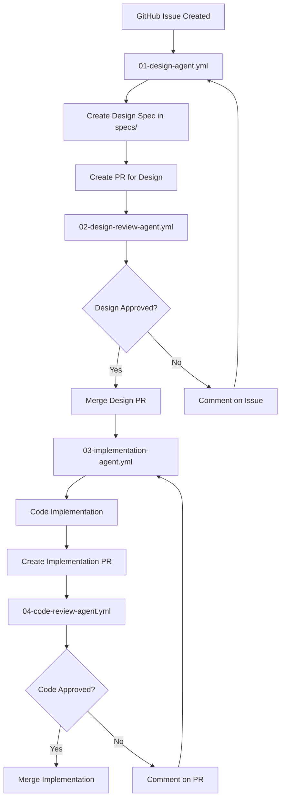

# Multi-Agent Design & Development Workflow

This directory contains a four-agent workflow system that automates the entire software development lifecycle from issue analysis to code implementation.

## Workflow Overview



## Agents

### 1. Design Agent (`01-design-agent.yml`)
**Triggers**: Issue opened, labeled with 'needs-design', or @design-agent mentioned
**Purpose**: Analyzes issues and creates comprehensive design specifications
**Model**: Claude Sonnet (balanced capability and cost)
**Output**: Design specification in `specs/` directory + PR

### 2. Design Review Agent (`02-design-review-agent.yml`)
**Triggers**: PR opened/updated in `specs/` directory
**Purpose**: Reviews design specifications for completeness and quality
**Model**: Claude Opus (highest reasoning capability)
**Output**: PR review with approval/changes requested

### 3. Implementation Agent (`03-implementation-agent.yml`)
**Triggers**: Design PR merged or manual dispatch
**Purpose**: Implements approved designs with full code, tests, and documentation
**Model**: Claude Sonnet (good for code generation)
**Output**: Complete implementation + PR

### 4. Code Review Agent (`04-code-review-agent.yml`)
**Triggers**: Implementation PR opened/updated
**Purpose**: Reviews code quality, security, and compliance
**Model**: Claude Opus (thorough analysis)
**Output**: PR review with security scan results

## Setup Requirements

### 1. Repository Secrets
Add these secrets to your GitHub repository:

```
AWS_ROLE_ARN          # AWS IAM role for Bedrock access (optional)
GITHUB_TOKEN          # GitHub token (automatically provided)
LANGFUSE_PUBLIC_KEY   # For LLM observability (optional)
LANGFUSE_SECRET_KEY   # For LLM observability (optional)
SLACK_BOT_TOKEN       # For notifications (optional)
```

### 2. Repository Structure
Ensure these directories exist:
```
specs/                # Design specifications
├── templates/        # Specification templates
└── README.md

src/                  # Implementation code (created by agents)
```

### 3. Branch Protection Rules
Configure branch protection for:
- `main` branch: Require PR reviews
- `design/*` branches: Require design review approval
- `feature/*` branches: Require code review approval

### 4. Issue Templates
Create issue templates in `.github/ISSUE_TEMPLATE/` for:
- Feature requests
- Bug reports
- Enhancements
- Security issues

## Usage Examples

### Creating a Feature Request
1. Create a GitHub issue with detailed requirements
2. Add label `needs-design` or mention `@design-agent`
3. Design Agent will analyze and create specification
4. Design Review Agent will review the specification
5. Once approved, Implementation Agent will create the code
6. Code Review Agent will review the implementation

### Manual Triggers
You can manually trigger agents using workflow dispatch:
- Implementation Agent: Specify spec file and issue number
- All agents support manual execution for testing

## Configuration Options

### Model Selection
Each agent uses different models optimized for their tasks:
- **Design Agent**: Claude Sonnet (balanced)
- **Design Review Agent**: Claude Opus (thorough)
- **Implementation Agent**: Claude Sonnet (code generation)
- **Code Review Agent**: Claude Opus (analysis)

### Tool Configuration
Agents have access to different tool sets:
- **Design Agent**: GitHub, file operations, thinking
- **Design Review Agent**: GitHub, PR operations, analysis
- **Implementation Agent**: Full development stack
- **Code Review Agent**: Analysis, security scanning

### Customization
Modify the workflow files to:
- Change model providers (OpenAI, Anthropic, etc.)
- Adjust system prompts for your domain
- Add custom tools or integrations
- Modify trigger conditions
- Add notification channels

## Monitoring & Observability

### GitHub Actions Logs
Monitor workflow execution in the Actions tab

### LLM Observability (Optional)
Configure Langfuse for detailed LLM performance tracking:
- Token usage and costs
- Response quality metrics
- Performance analytics
- Error tracking

### Notifications (Optional)
Configure Slack integration for:
- Design approvals/rejections
- Implementation completions
- Code review results
- Security alerts

## Best Practices

### Issue Creation
- Use detailed issue descriptions
- Include acceptance criteria
- Add relevant labels
- Provide context and examples

### Design Reviews
- Review specifications thoroughly
- Provide constructive feedback
- Consider long-term implications
- Validate security requirements

### Code Reviews
- Focus on maintainability
- Verify test coverage
- Check security implications
- Validate performance impact

## Troubleshooting

### Common Issues
1. **Agent not triggering**: Check trigger conditions and labels
2. **Permission errors**: Verify GitHub token permissions
3. **Model errors**: Check AWS role configuration
4. **File conflicts**: Ensure proper branch management

### Debug Mode
Enable debug logging by setting `STRANDS_DEBUG=1` in workflow environment

### Manual Intervention
If agents get stuck:
1. Check workflow logs for errors
2. Manually trigger next step using workflow dispatch
3. Create manual PRs if needed
4. Adjust system prompts for better results

## Security Considerations

- All code is reviewed by security-focused agents
- Secrets are managed through GitHub Secrets
- AWS roles use least-privilege access
- All changes go through PR review process
- Security scanning is automated

## Cost Optimization

- Different models used based on task complexity
- Token limits set to prevent runaway costs
- Caching and reuse where possible
- Monitor usage through Langfuse integration
