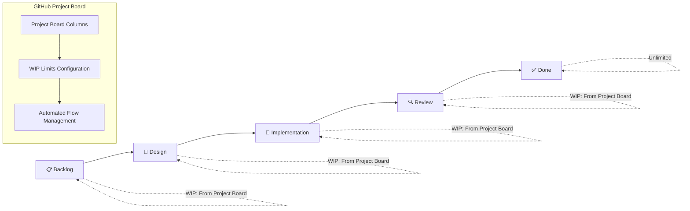

# Automated Project Management Workflows

This repository uses an orchestrated approach to project management with AI agents that automatically manage the development workflow from issue creation to completion.

## Workflow Architecture

### 🎯 Orchestration Agent (00-orchestration-agent.yml)
**The Master Controller** - This is the only workflow that triggers on GitHub events and runs hourly.

**Responsibilities:**
- Monitors all GitHub events (issues, PRs, comments, etc.)
- **Integrates with GitHub Project Boards** to read WIP limits and current state
- Manages project flow based on **actual project board configuration**
- Triggers other agents based on project board capacity and state
- Maintains Kanban flow optimization using project board metrics
- Prevents bottlenecks and ensures steady progress through project board columns

**Triggers:**
- All GitHub events (issues, PRs, comments, reviews)
- Hourly schedule (cron: '0 * * * *')
- Manual dispatch with configuration options

**Key Features:**
- **Automatic Project Board Setup**: Creates and configures GitHub Project boards automatically
- **Intelligent WIP Limits**: Calculates optimal WIP limits based on team size and repository activity
- **Dynamic Configuration**: Continuously optimizes project board settings based on flow metrics
- **Smart Automations**: Configures project board automations that enhance workflow efficiency
- **Repository Analysis**: Analyzes repository activity to determine optimal configuration
- **Flow Optimization**: Automatically moves work through project board columns
- **Bottleneck Detection**: Identifies workflow blockages using project board analytics
- **Priority Handling**: Supports urgent mode that bypasses project board WIP limits
- **Agent Coordination**: Triggers appropriate agents based on project board capacity

### 🎨 Design Agent (01-design-agent.yml)
**The Solution Architect** - Creates comprehensive design specifications.

**Triggered by:** Orchestration Agent when issues need design work
**Input:** Issue number and priority level
**Output:** Design specification saved to `specs/` directory

**Responsibilities:**
- Analyze issue requirements thoroughly
- Create comprehensive design specifications
- Consider security, scalability, and maintainability
- Generate technical implementation approaches
- Create pull requests with design documents

### 📋 Design Review Agent (02-design-review-agent.yml)
**The Technical Reviewer** - Reviews and approves design specifications.

**Triggered by:** Orchestration Agent when design PRs need review
**Input:** PR number and review type
**Output:** Design review with approval/rejection decision

**Responsibilities:**
- Validate technical feasibility and architecture
- Check security and compliance requirements
- Assess resource requirements and timelines
- Provide detailed feedback and recommendations
- Approve or request changes to designs

### 🔨 Implementation Agent (03-implementation-agent.yml)
**The Senior Engineer** - Implements approved designs into working code.

**Triggered by:** Orchestration Agent when designs are approved
**Input:** Specification file path, issue number, and priority
**Output:** Complete implementation with tests and documentation

**Responsibilities:**
- Generate all necessary code files
- Create comprehensive unit and integration tests
- Implement proper error handling and logging
- Follow coding standards and best practices
- Create pull requests with complete implementations

### 🔍 Code Review Agent (04-code-review-agent.yml)
**The Quality Guardian** - Reviews implementation code for quality and security.

**Triggered by:** Orchestration Agent when implementation PRs are ready
**Input:** PR number and review focus area
**Output:** Comprehensive code review with security analysis

**Responsibilities:**
- Analyze code quality, structure, and maintainability
- Check for security vulnerabilities and best practices
- Validate test coverage and quality (target: >80%)
- Review performance implications
- Ensure compliance with coding standards

## Project Stages & Flow (GitHub Project Board Integration)



### Stage Definitions (Project Board Columns)

The orchestration agent automatically discovers and uses your GitHub Project board configuration:

1. **Backlog Column** (WIP: Set in Project Board)
   - Issues ready for design work
   - Properly labeled and categorized
   - Clear requirements and acceptance criteria
   - **WIP Limit**: Read from project board column settings

2. **Design Column** (WIP: Set in Project Board)
   - Issues being designed or awaiting design approval
   - Design specifications in progress
   - Design reviews and iterations
   - **WIP Limit**: Read from project board column settings

3. **Implementation Column** (WIP: Set in Project Board)
   - Approved designs being coded
   - Active development work
   - Unit and integration testing
   - **WIP Limit**: Read from project board column settings

4. **Review Column** (WIP: Set in Project Board)
   - Completed implementations under review
   - Code quality and security analysis
   - Feedback incorporation and approval
   - **WIP Limit**: Read from project board column settings

5. **Done Column** (Typically Unlimited)
   - Merged and completed work
   - All acceptance criteria met
   - Ready for deployment
   - **WIP Limit**: Usually unlimited (set in project board)

## Configuration

### GitHub Project Board Setup (Automatic Configuration)

**🚀 The orchestration agent automatically sets up and configures your GitHub Project board:**

#### Automatic Setup Process:

1. **Repository Analysis**
   - Analyzes contributor count and activity patterns
   - Calculates issue velocity and PR frequency
   - Determines optimal team size classification
   - Assesses current workflow bottlenecks

2. **Intelligent Project Board Creation**
   - Creates project board with optimal column structure
   - Calculates WIP limits based on team size and activity
   - Configures custom fields for priority, effort, and type tracking
   - Sets up automations for seamless workflow integration

3. **Smart WIP Limit Calculation**
   - **Backlog**: `team_size × 3 + 4` (scales with team size)
   - **Design**: `max(1, team_size ÷ 3)` (roughly 1 designer per 3 developers)
   - **Implementation**: `max(2, team_size ÷ 2)` (half the team can implement simultaneously)
   - **Review**: `max(2, team_size ÷ 3)` (review capacity based on team size)
   - **Done**: Unlimited

4. **Automated Project Board Optimizations**
   - Continuously monitors flow metrics
   - Adjusts WIP limits based on actual performance
   - Updates automations to improve workflow efficiency
   - Adds missing custom fields and configurations

#### Manual Setup Triggers:

```bash
# Force project board setup/optimization
gh workflow run 00-orchestration-agent.yml -f setup_project_board=true

# Setup with specific team size
gh workflow run 00-orchestration-agent.yml -f setup_project_board=true -f team_size="medium (4-8)"

# Auto-calculate WIP limits based on repository analysis
gh workflow run 00-orchestration-agent.yml -f wip_limit=auto
```

#### Project Board Features Automatically Configured:

- **📋 Backlog Column**: Issues ready for design work
- **🎨 Design Column**: Issues being designed or awaiting approval  
- **🔨 Implementation Column**: Approved designs being implemented
- **🔍 Review Column**: Completed implementations under review
- **✅ Done Column**: Completed and merged work

- **Custom Fields**:
  - Priority (🚨 Urgent, ⚡ High, 📋 Normal, 📝 Low)
  - Effort (Story points or hours)
  - Type (✨ Feature, 🐛 Bug, 🔧 Enhancement, 🧹 Chore)
  - Sprint (Current sprint identifier)

- **Smart Automations**:
  - Auto-add new issues to Backlog
  - Auto-move items based on PR status
  - Auto-assign based on column and expertise
  - Stale item detection and alerts

### Project Configuration (.github/project-config.yml)
Provides fallback settings and automation rules when project board is not available.

### Manual Triggers
All agents can be manually triggered via workflow_dispatch:

```bash
# Trigger design for specific issue
gh workflow run 01-design-agent.yml -f issue_number=123 -f priority=high

# Trigger implementation for approved design
gh workflow run 03-implementation-agent.yml -f spec_file=specs/123-feature.md -f issue_number=123

# Trigger code review for PR
gh workflow run 04-code-review-agent.yml -f pr_number=456 -f review_focus=security
```

### Orchestration Controls
The orchestration agent supports several control parameters:

- **Auto WIP Limits**: Automatically calculate optimal WIP limits based on repository analysis
- **Project Board Setup**: Force creation or optimization of project board configuration
- **Team Size Override**: Specify team size for more accurate WIP limit calculation
- **Urgent Mode**: Bypass project board WIP limits for critical work
- **Focus Stage**: Prioritize specific project board columns

### Advanced Configuration Options

```bash
# Complete project board setup with team size specification
gh workflow run 00-orchestration-agent.yml \
  -f setup_project_board=true \
  -f team_size="large (9+)" \
  -f wip_limit=auto

# Optimize existing project board
gh workflow run 00-orchestration-agent.yml \
  -f setup_project_board=true

# Emergency mode with bypassed limits
gh workflow run 00-orchestration-agent.yml \
  -f urgent_mode=true \
  -f focus_stage=implementation
```

## Monitoring & Metrics

The orchestration agent tracks key metrics using **GitHub Project board data**:

- **Cycle Time**: Time from backlog to completion (tracked via project board card movement)
- **Lead Time**: Time from design to implementation (tracked via project board column transitions)
- **Throughput**: Completion rate (tracked via project board done column)
- **WIP Efficiency**: Utilization of project board column capacity
- **Flow Efficiency**: Time spent in active work vs waiting (project board analytics)

### Project Board Analytics Integration

The system provides enhanced metrics by integrating with GitHub Project board data:

- **Column Utilization**: How full each project board column is relative to its WIP limit
- **Flow Rate**: Items moving through project board columns per time period
- **Bottleneck Detection**: Columns that consistently hit WIP limits
- **Starvation Alerts**: Empty columns that should have work flowing to them
- **Capacity Planning**: Recommendations for adjusting project board WIP limits

## Best Practices

### For Contributors
1. **Clear Issue Descriptions**: Provide detailed requirements and acceptance criteria
2. **Project Board Usage**: Add issues to the project board for automatic management
3. **Priority Setting**: Mark urgent items appropriately (use priority indicators in project board)
4. **Feedback Loop**: Respond to agent comments and reviews promptly

### For Maintainers
1. **Automatic Setup**: Let the orchestration agent create and configure the project board automatically
2. **Monitor Flow**: Check orchestration agent reports and project board analytics regularly
3. **Trust the Algorithm**: The agent continuously optimizes WIP limits based on actual performance
4. **Review Metrics**: Analyze cycle time and throughput trends from project board data
5. **Handle Escalations**: Address bottlenecks and urgent items quickly
6. **Customize as Needed**: Override automatic settings when specific business needs require it

## Troubleshooting

### Common Issues

1. **WIP Limits Exceeded**
   - Check project board column capacity and current item count
   - Consider temporarily increasing project board WIP limits
   - Focus on completing current work before starting new

2. **Project Board Setup Issues**
   - Run orchestration agent with `setup_project_board=true` to force reconfiguration
   - Check repository permissions for project board creation and management
   - Verify GitHub token has necessary scopes for project board operations
   - Review orchestration agent logs for specific setup errors

3. **Stage Starvation**
   - Ensure upstream project board columns have work ready
   - Check for blocking dependencies in project board
   - Consider prioritizing upstream work

4. **Agent Failures**
   - Check workflow logs for error details
   - Verify AWS credentials and permissions
   - Retry failed workflows manually if needed

### Emergency Procedures

1. **Urgent Work**: Use urgent mode to bypass project board WIP limits
2. **Project Board Issues**: Agent automatically recreates or fixes project board configuration
3. **System Issues**: Disable orchestration and run agents manually
4. **Capacity Changes**: Agent automatically adjusts WIP limits based on team changes

## Security & Permissions

All workflows require:
- `contents: write` - For creating files and commits
- `issues: write` - For managing issues and labels
- `pull-requests: write` - For creating and managing PRs
- `actions: write` - For triggering other workflows

AWS credentials are required for Bedrock model access via OIDC role assumption.

## Future Enhancements

- **Slack Integration**: Real-time notifications and status updates
- **Dashboard**: Visual project health and metrics display
- **Advanced Analytics**: Predictive bottleneck detection
- **Custom Rules**: Configurable automation rules per project
- **Multi-Repository**: Support for cross-repository workflows
